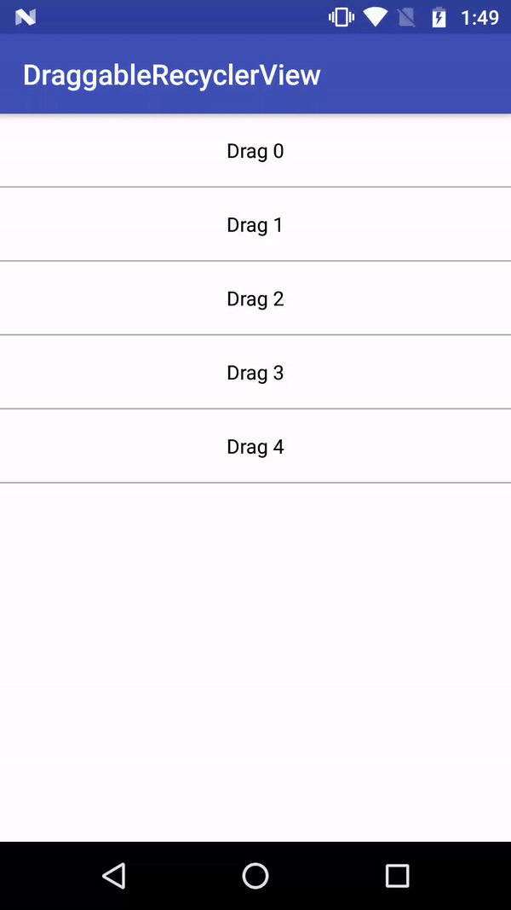

## Draggable RecyclerView

DraggableRecyclerView provides a wrapper class [DragItemTouchHelperCallback](./app/src/main/java/com/fueled/draggablerecyclerview/DragItemTouchHelperCallback.java) extends `ItemTouchHelper.Callback` which you can use to add Dragging capability to your RecyclerView items. You can make use of `DataBinding` to bind it via XML.



## How to Use

```java
ItemTouchHelper.Callback dragCallback = new DragItemTouchHelperCallback
        .Builder(ItemTouchHelper.UP | ItemTouchHelper.DOWN, 0)
        .setDragEnabled(dragEnabled)
        .onItemDragListener(onItemDrag)
        .build();

ItemTouchHelper itemTouchHelper = new ItemTouchHelper(dragCallback);
itemTouchHelper.attachToRecyclerView(recyclerView);
```

## How to Bind

In your `Gradle`

```groovy
dataBinding {
    enabled = true
}
```

In your `BindingAdapter`

```java
/**
 * @param recyclerView      RecyclerView to bind to DragItemTouchHelperCallback
 * @param dragEnabled       enable/disable swipe
 * @param onItemDrag        OnItemDragListener for dragged
 */
@android.databinding.BindingAdapter(value = {"dragEnabled", "onItemDrag"}, requireAll = false)
public static void setItemDragToRecyclerView(RecyclerView recyclerView, boolean dragEnabled,
                                             DragItemTouchHelperCallback.OnItemDragListener onItemDrag) {

    ... // attach RecyclerView to DragItemTouchHelperCallback as above
}
```

In your `XML` file

```xml
<android.support.v7.widget.RecyclerView
    android:id="@+id/rv"
    android:layout_width="match_parent"
    android:layout_height="match_parent"
    android:background="@android:color/white"
    bind:dragEnabled="@{true}"
    bind:onItemDrag="@{(indexFrom, indexTo) -> handler.onItemDragged(indexFrom, indexTo)}"/>
```

## Library used

Add Android Support Design dependency to your gradle file.

```groovy
dependencies {
    compile 'com.android.support:design:{latest_version}'
}
```

## Reference

- [ItemTouchHelper.SimpleCallback](https://developer.android.com/reference/android/support/v7/widget/helper/ItemTouchHelper.SimpleCallback.html)
- [Drag and Swipe with RecyclerView](https://medium.com/@ipaulpro/drag-and-swipe-with-recyclerview-b9456d2b1aaf)